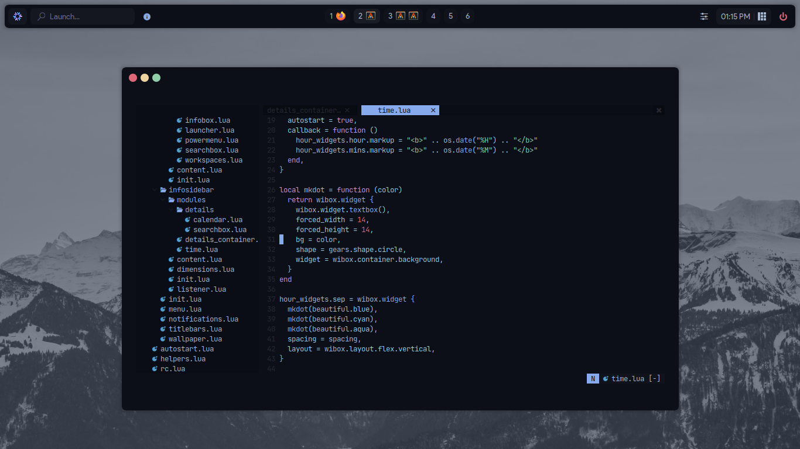

# nixdots

My personal dotfiles for a Nix-Managed Operative System (NixOS).

> Maybe some things may not work as how should, or look different from the screenshots

> since this dots are intended to be for my personal use and not stable :|

> if you want stable dotfiles and others design ideas, check my official [dotfiles](https://github.com/AlphaTechnolog/dotfiles)

> X11 (AwesomeWM)


> Wayland (Hyprland)


> [!TIP]
> If you're looking for a (imo) very better structured nixos configuration, you could
> look at my new maintained nixos configuration [nixmoment](https://github.com/alphatechnolog/nixmoment)
> imo it's far organised and i've put more nix experience in the building process of it
> this one could be pretty outdated when it comes to packages and you may experience
> issues when updating the system now since things could've changed a lot

## Installation

To install it see the next steps:

- Boot into the installer environment
- Format and mount your disks inside /mnt
- execute this

```sh
# go into a root shell
sudo su

# go inside a shell with properly required programs
nix-shell -p git nixUnstable

# create this folder if necessary
mkdir -p /mnt/etc/

# clone the repo
git clone https://github.com/AlphaTechnolog/nixdots.git /mnt/etc/nixos --recurse-submodules

# remove this file
rm /mnt/etc/nixos/hosts/ultra/hardware-configuration.nix

# generate the config and take some files
nixos-generate-config --root /mnt
rm /mnt/etc/nixos/configuration.nix
mv /mnt/etc/nixos/hardware-configuration.nix /mnt/etc/nixos/hosts/ultra

# make sure you're in this path
cd /mnt/etc/nixos

# to install the xorg version:
nixos-install --flake '.#ultra' --impure

# to install the wayland version
nixos-install --flake '.#fancy' --impure
```

> You could get some hashes errors, just change the bad hashes in the config file to the given ones by the Nix Output.

- Reboot, login as root, and change the password for your user using `passwd` (by default, it's alpha)
- Log-in in the displayManager.
- Then do this:

```sh
doas chown -R $USER /etc/nixos
```

## Enjoy

Now, you're done, remember that this is in work in progress so, some
things could stop working...

## Thanks to

This good people who helped me when learning nix-related stuff! really, thanks!

- [AloneER0](https://github.com/AloneER0)
- [JavaCafe01](https://github.com/JavaCafe01)
- [rxyhn](https://github.com/rxyhn)

## Inspiration

- nvim: [dharmx](https://github.com/dharmx). What a beautiful nvim that he has!

> How looks mine:


