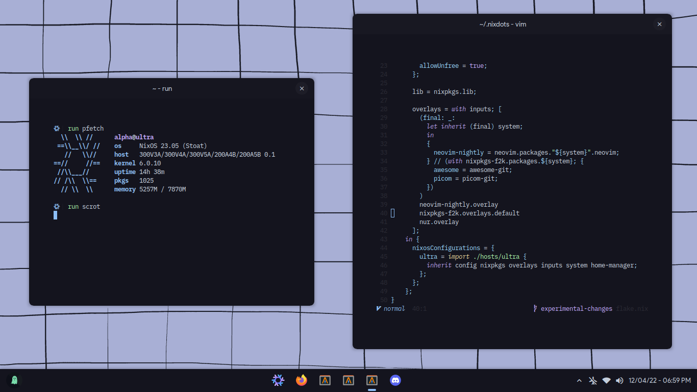

# nixdots

This repo contains my dotfiles for a flakes-based WIP nixos-setup.

It's WIP (work in progress) because there are many things that should be managed
by nix itself, like some fonts lol



## Installation

To install it see the next steps:

- Boot into the installer environment
- Format and mount your disks inside /mnt
- execute this

```sh
# go into a root shell
sudo su

# go inside a shell with properly required programs
nix-shell -p git nixUnstable

# create this folder if necessary
mkdir -p /mnt/etc/

# clone the repo
git clone https://github.com/AlphaTechnolog/nixfiles.git /mnt/etc/nixos.git --recurse-submodules

# remove this file
rm /mnt/etc/nixos/hosts/ultra/hardware-configuration.nix

# generate the config and take some files
nixos-generate-config --root /mnt
rm /mnt/etc/nixos/configuration.nix
mv /mnt/etc/nixos/hardware-configuration.nix /mnt/etc/nixos/hosts/ultra

# make sure you're in this path
cd /mnt/etc/nixos

# remove .git to avoid some issues with nixos-rebuild
rm -rf ./.git

# install it!
nixos-install --flake '.#ultra'
```

- Reboot, login as root, and change the password for your user using `passwd` (by default, it's alpha)
- Log-in in the displayManager.
- Then do this:

```sh
doas chown -R $USER /etc/nixos
```

# Known Issues

There is some misconfiguration in this repo that i can't solve for now, i just don't found the bug :/
if you know what can i be doing bad, please, open an issue and tell me! i'll be very grateful.

The issue is related with nixos-rebuild, after the `nixos-install`, you would need to use `nixos-rebuild`
to rebuild the system when changing some thing in this flake, so the right command to do that should be this:

```sh
cd /etc/nixos
doas nixos-rebuild switch --flake '.#ultra'
```

But it throws errors with git that i can't solve for now, if you remove the `.git` folder it works fine :/

## Extra fonts

> This fonts will be managed by nix in the next commits, this is a temporary step.

Install [Google Sans](https://www.cufonfonts.com/font/google-sans) inside `~/.local/share/fonts` and run `fc-cache -vf`

## Enjoy

Now, you're done, remember that this is in work in progress so, some
things could stop working...

## Thanks to

This good people who helped me when learning nix-related stuff! really, thanks!

- [AloneER0](https://github.com/AloneER0)
- [JavaCafe01](https://github.com/JavaCafe01)
- [rxyhn](https://github.com/rxyhn)
